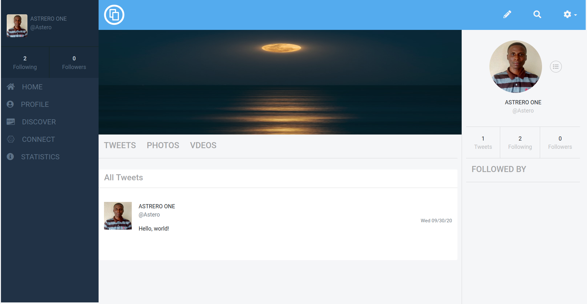

# Twitter Redesign Capstone Project

> I built this project as an assignment(capstone project) at the  end of Ruby on Rails module of the  Microverse Main Curriculum



## Built With

* Ruby v2.7.0

* Ruby on Rails v6.0.3.3

* Postgresql v12

* Heroku CL

## Live Demo

* [Live Demo Link](https://jelil-twitter-redesign.herokuapp.com/)

## Getting Started

To get a local copy up and running follow these simple example steps.

### Prerequisites

* Ruby: 2.7.3

* Rails: v6.0.3.3

* Postgres: >=9.5

### Setup

#### Instal gems with:

```bash
bundle install
```

#### Setup database with:

```bash
   rails db:create
   rails db:migrate
```

### Usage

#### Start server with:

```bash
    rails server
```

Open `http://localhost:3000/` in your browser.

### Run tests

```bash
    rpsec --format documentation
```

### Deployment

Deploy your of the app to Heroku using the following steps in your terminal.

* Navigate to the project's directory and make changes to your codes.

* Commit your works

* Enter these commands

```bash
    heroku create <your-app-name(optional)>
```

```bash
    git push heroku master
```

#### NOTE

In case you want deploy to Heroku from a defferent branch aprt from the master branch,
all you to do is to skip the second step and run this;

```bash
    git push heroku <branch-name>:master
```

## Authors

👤 Jelil Faisal Abudu

* Github: [JelilFaisalAbudu](https://github.com/JelilFaisalAbudu)
* Twitter: [@jelilabudu](https://twitter.com/jelilabudu)
* Linkedin: [jelilfaisalabudu](www.linkedin.com/in/jelilfaisalabudu)

## 🤝 Contributing

Contributions, issues and feature requests are welcome!

Feel free to check the [issues page](https://github.com/JelilFaisalAbudu/twitter-redesign/issues).

## Show your support

Give a ⭐️ if you like this project!

## Acknowledgments

* [Gregoire Vella](https://www.behance.net/gregoirevella) for the project's design

* [Font Awesome](https://fontawesome.com/) for providing free icons

* [Pixabay](https://pixabay.com/) for photos

* My Stand-up Team Memmbers. You guys are really awesome
